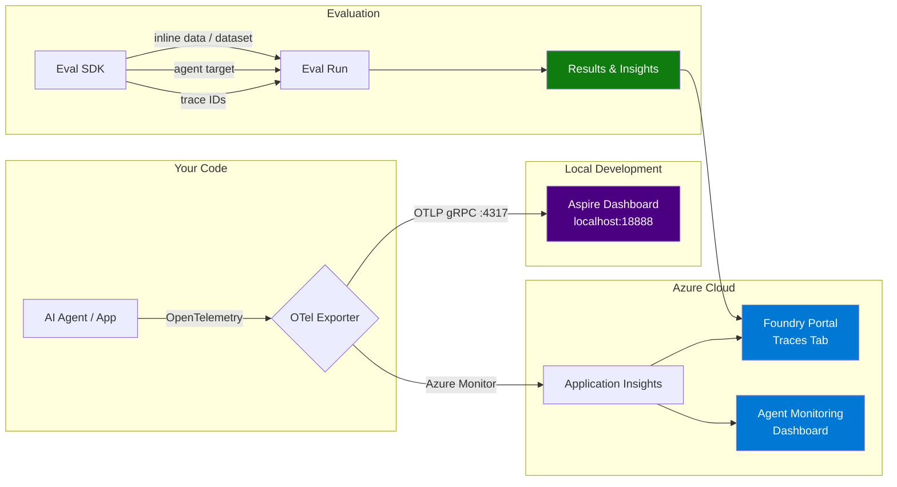

# Azure AI Foundry — Observability

A hands-on repository with clear documentation and progressive examples demonstrating **Observability in Azure AI Foundry**: tracing, evaluation, monitoring, and agent-specific observability.

## Architecture



## The Three Pillars of Foundry Observability

| Pillar | What it does | Key SDK entry point |
|--------|-------------|---------------------|
| **Tracing** | Captures execution flow — inputs, outputs, tool calls, latency | `AIProjectInstrumentor().instrument()` |
| **Evaluation** | Measures quality, safety, and reliability with built-in evaluators | `openai_client.evals.create()` |
| **Monitoring** | Continuous and scheduled evaluation of production traffic | `project_client.evaluation_rules.create_or_update()` |

## Prerequisites

- Python 3.9+
- An [Azure AI Foundry project](https://learn.microsoft.com/azure/foundry/how-to/create-projects)
- Azure CLI installed and logged in (`az login`)
- Docker (for the local Aspire Dashboard — included in the devcontainer)

## Quickstart

### 1. Clone & set up environment

```bash
git clone https://github.com/<your-org>/FoundryObservability.git
cd FoundryObservability
cp .env.example .env
# Edit .env with your project endpoint and model deployment name
```

### 2. Install dependencies

```bash
pip install -r requirements.txt
```

### 3. Start the Aspire Dashboard (local trace viewer)

```bash
docker compose up -d
# Dashboard UI → http://localhost:18888
# OTLP endpoint → http://localhost:4317
```

> **Using the devcontainer?** The Aspire Dashboard starts automatically.

### 4. Run your first tracing example

```bash
python examples/01_tracing_console/tracing_console.py
```

### 5. See traces in Aspire Dashboard

```bash
python examples/02_tracing_aspire_dashboard/tracing_aspire.py
# Open http://localhost:18888 → Traces tab
```

## Examples

### Tracing

| # | Example | Description | Docs |
|---|---------|-------------|------|
| 01 | [Console Tracing](examples/01_tracing_console/) | Trace spans printed to stdout — quickest way to see what's happening | [Tracing](docs/03-tracing.md) |
| 02 | [Aspire Dashboard](examples/02_tracing_aspire_dashboard/) | Traces visualized in the local Aspire Dashboard UI | [Tracing](docs/03-tracing.md) |
| 03 | [Azure Monitor](examples/03_tracing_azure_monitor/) | Traces sent to Application Insights and visible in Foundry portal | [Tracing](docs/03-tracing.md) |
| 04 | [Custom Spans](examples/04_tracing_custom_spans/) | Custom span processors, attributes, and the `trace_function` decorator | [Tracing](docs/03-tracing.md) |

### Evaluation

| # | Example | Description | Docs |
|---|---------|-------------|------|
| 05 | [Inline Data Eval](examples/05_eval_inline_data/) | Evaluate with inline JSONL data and built-in evaluators | [Evaluations](docs/04-evaluations.md) |
| 06 | [Agent Eval](examples/06_eval_agent/) | Evaluate an agent as a target (runs the agent live) | [Evaluations](docs/04-evaluations.md) |
| 07 | [Trace-Based Eval](examples/07_eval_traces/) | Evaluate against traces collected in Application Insights | [Evaluations](docs/04-evaluations.md) |

### Monitoring

| # | Example | Description | Docs |
|---|---------|-------------|------|
| 08 | [Continuous Eval](examples/08_eval_continuous/) | Automatic evaluation of every agent response via rules | [Monitoring](docs/05-monitoring.md) |
| 09 | [Scheduled Eval](examples/09_eval_scheduled/) | Recurring evaluations on a schedule (daily, hourly, etc.) | [Monitoring](docs/05-monitoring.md) |

### Agent Observability

| # | Example | Description | Docs |
|---|---------|-------------|------|
| 10 | [Agent Tracing](examples/10_agent_tracing/) | Trace a multi-tool agent — see tool calls, reasoning, latency | [Agent Observability](docs/06-agent-observability.md) |
| 11 | [Agent Evaluation](examples/11_agent_evaluation/) | Evaluate agent-specific metrics: tool accuracy, task adherence, etc. | [Agent Observability](docs/06-agent-observability.md) |

> Every example includes both **sync** and **async** variants. See [Async Patterns](docs/08-async-patterns.md) for guidance on when to use each.

## Documentation

| # | Document | Description |
|---|----------|-------------|
| 01 | [Core Concepts](docs/01-concepts.md) | OpenTelemetry, traces, spans, attributes, data flow in Foundry |
| 02 | [Setup Guide](docs/02-setup.md) | Project creation, Application Insights, SDK install, environment variables, RBAC |
| 03 | [Tracing Deep-Dive](docs/03-tracing.md) | Instrumentor, exporters, content recording, trace propagation, custom functions |
| 04 | [Evaluations Deep-Dive](docs/04-evaluations.md) | Evaluation flow, data sources, testing criteria, data mapping, insights |
| 05 | [Monitoring](docs/05-monitoring.md) | Continuous rules, scheduled evaluations, dashboards, alerts |
| 06 | [Agent Observability](docs/06-agent-observability.md) | Agent-specific tracing and evaluation, tool call metrics |
| 07 | [Evaluator Reference](docs/07-evaluator-reference.md) | Complete catalog of built-in evaluators with data mappings |
| 08 | [Async Patterns](docs/08-async-patterns.md) | Pros, cons, when to use sync vs async, code patterns |

## Official References

- [Observability in generative AI](https://learn.microsoft.com/azure/foundry/concepts/observability)
- [Agent tracing overview](https://learn.microsoft.com/azure/foundry/observability/concepts/trace-agent-concept)
- [Set up tracing in Foundry](https://learn.microsoft.com/azure/foundry/observability/how-to/trace-agent-setup)
- [Azure AI Projects Python SDK](https://github.com/Azure/azure-sdk-for-python/tree/main/sdk/ai/azure-ai-projects)
- [SDK Evaluation Samples](https://github.com/Azure/azure-sdk-for-python/tree/main/sdk/ai/azure-ai-projects/samples/evaluations)
- [SDK Telemetry Samples](https://github.com/Azure/azure-sdk-for-python/tree/main/sdk/ai/azure-ai-projects/samples/agents/telemetry)
- [Aspire Dashboard (standalone)](https://aspire.dev/dashboard/standalone/)
