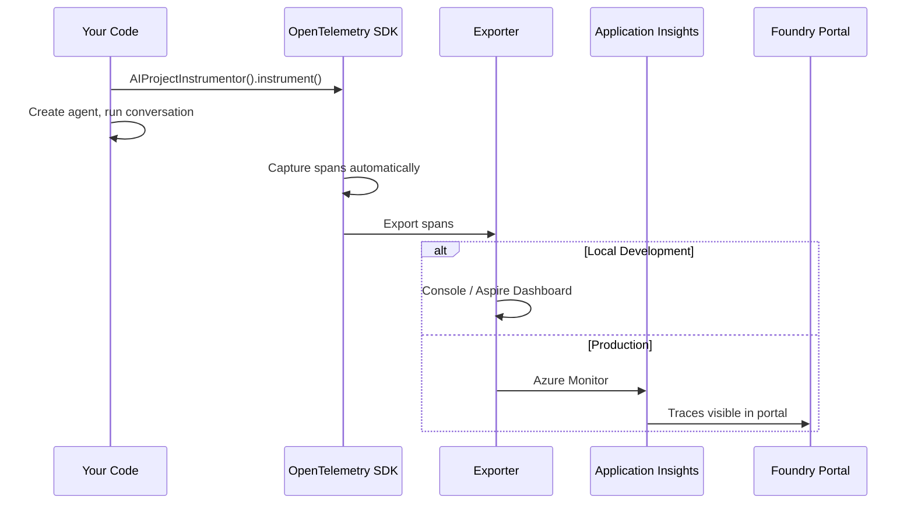

# Core Concepts — Observability in Azure AI Foundry

## What Is AI Observability?

AI observability is the ability to **monitor, understand, and troubleshoot** AI systems throughout their lifecycle. It lets you:

- **Trace** every step of an agent's execution (inputs, outputs, tool calls, latency).
- **Evaluate** the quality and safety of responses using standardized metrics.
- **Monitor** production systems with continuous quality gates and alerts.

Without observability, debugging complex AI agents is like debugging a black box — you see the input and the output, but not what happened in between.

## OpenTelemetry — The Foundation

Azure AI Foundry builds on [OpenTelemetry](https://opentelemetry.io/) (OTel), the industry-standard framework for collecting and routing telemetry data.

### Key Concepts

| Concept | Description |
|---------|-------------|
| **Trace** | The end-to-end journey of a request through your application. A trace is made up of spans. |
| **Span** | A single operation within a trace (e.g., an LLM call, a tool invocation). Spans have start/end times, attributes, and can be nested hierarchically. |
| **Attribute** | A key-value pair attached to a span providing metadata (e.g., `gen_ai.agent.id`, `gen_ai.system`). |
| **Event** | A timestamped annotation within a span (e.g., an evaluation result). |
| **Exporter** | A component that sends trace data to a backend for visualization and analysis. |
| **Semantic Conventions** | Standardized names for attributes and spans so traces are consistent across tools. |

### Visualization

```
Trace: "User asks about France"
├── Span: create_conversation
├── Span: responses.create (LLM call)
│   ├── Attribute: gen_ai.agent.id = "agent_abc123"
│   ├── Attribute: gen_ai.usage.input_tokens = 42
│   ├── Attribute: gen_ai.usage.output_tokens = 128
│   └── Attribute: gen_ai.response.model = "gpt-4o-mini"
├── Span: tool_call (if agent uses tools)
│   ├── Attribute: tool.call.arguments = {...}
│   └── Attribute: tool.call.results = {...}
└── Span: responses.create (follow-up)
```

## How Data Flows in Foundry



1. **Instrument** — Call `AIProjectInstrumentor().instrument()` before creating any clients.
2. **Automatic capture** — The SDK automatically creates spans for agent operations, LLM calls, tool invocations, etc.
3. **Export** — Spans are sent to your chosen backend: console (dev), Aspire Dashboard (local UI), or Azure Monitor (production).
4. **Visualize** — View traces in the Foundry portal Traces tab, Application Insights, or the Aspire Dashboard.

## Multi-Agent Semantic Conventions

Microsoft, in collaboration with Cisco Outshift, has introduced semantic conventions for multi-agent systems, built on [OpenTelemetry GenAI conventions](https://opentelemetry.io/docs/specs/semconv/gen-ai/gen-ai-agent-spans/) and [W3C Trace Context](https://www.w3.org/TR/trace-context/).

You don't need to set these manually — the SDK handles most of them automatically. The key ones to know:

| Type | Name | What it does | Automatic? |
|------|------|-------------|------------|
| Span | `execute_task` | Top-level task execution | ✅ Yes |
| Child Span | `agent_to_agent_interaction` | Communication between agents | ✅ Yes (multi-agent) |
| Attribute | `gen_ai.agent.id` | Agent identifier | ✅ Yes (with `agent_reference`) |
| Attribute | `tool.call.arguments` | Arguments passed to tools | ✅ Yes |
| Attribute | `tool.call.results` | Results returned by tools | ✅ Yes |
| Attribute | `gen_ai.usage.input_tokens` | Input token count | ✅ Yes |
| Event | `Evaluation` | Evaluation results | ✅ Yes (continuous eval) |

These conventions are integrated into Foundry, Semantic Kernel, LangChain, LangGraph, and the OpenAI Agents SDK.

## Security and Privacy

Tracing can capture sensitive information. Follow these practices:

- **Content recording is off by default** — `OTEL_INSTRUMENTATION_GENAI_CAPTURE_MESSAGE_CONTENT` is `false`. When off, traces only include metadata (model name, token counts, latency). Turn it on only in development.
- **Watch for secrets in tool arguments** — If your tools receive API keys, connection strings, or tokens as parameters, these will appear in traces when content recording is on.
- **`@trace_function` always captures parameters** — Unlike SDK instrumentation, the `trace_function` decorator records function arguments and return values regardless of the content recording flag. Don't decorate functions that handle secrets.
- **Treat traces like logs** — Apply the same access controls and retention policies. Use the `Log Analytics Reader` role to restrict who can query traces in Application Insights.

---

**Next:** [Setup Guide →](02-setup.md)
