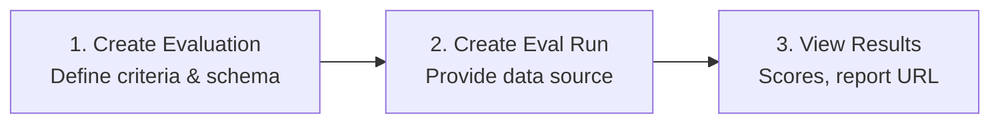

# Evaluations Deep-Dive

Evaluation in Azure AI Foundry provides **quantitative, AI-assisted quality and safety metrics** to assess LLM models, GenAI applications, and agents.

## How Evaluations Work

The evaluation flow has three steps:



1. **Create an Evaluation** — Define the testing criteria (which evaluators to run) and the data schema.
2. **Create an Eval Run** — Provide the actual data (inline, uploaded dataset, agent target, or traces).
3. **View Results** — Poll until completed, then inspect scores and the report URL.

## Creating an Evaluation

```python
from openai.types.eval_create_params import DataSourceConfigCustom

# Define the data schema
data_source_config = DataSourceConfigCustom(
    type="custom",
    item_schema={
        "type": "object",
        "properties": {
            "query": {"type": "string"},
            "response": {"type": "string"},
            "context": {"type": "string"},
            "ground_truth": {"type": "string"},
        },
        "required": ["query"],
    },
    include_sample_schema=True,
)

# Define testing criteria
testing_criteria = [
    {
        "type": "azure_ai_evaluator",
        "name": "violence",
        "evaluator_name": "builtin.violence",
        "data_mapping": {"query": "{{item.query}}", "response": "{{item.response}}"},
    },
    {
        "type": "azure_ai_evaluator",
        "name": "coherence",
        "evaluator_name": "builtin.coherence",
        "initialization_parameters": {"deployment_name": "gpt-4o-mini"},
        "data_mapping": {"query": "{{item.query}}", "response": "{{item.response}}"},
    },
]

# Create the evaluation
eval_object = openai_client.evals.create(
    name="My Evaluation",
    data_source_config=data_source_config,
    testing_criteria=testing_criteria,
)
```

## Data Source Types

When creating an **Eval Run**, you choose how to provide data:

### Inline JSONL (`jsonl` with `file_content`)

Provide data directly in the code — best for quick tests.

```python
from openai.types.evals.create_eval_jsonl_run_data_source_param import (
    CreateEvalJSONLRunDataSourceParam, SourceFileContent, SourceFileContentContent,
)

data_source = CreateEvalJSONLRunDataSourceParam(
    type="jsonl",
    source=SourceFileContent(
        type="file_content",
        content=[
            SourceFileContentContent(item={"query": "What is the capital of France?", "response": "Paris."}),
            SourceFileContentContent(item={"query": "Explain quantum computing", "response": "..."}),
        ],
    ),
)
```

→ [Example 05: Inline Data Eval](../examples/05_eval_inline_data/)

### Agent as Target (`azure_ai_target_completions`)

The evaluation **runs the agent** with your test queries and evaluates its responses.

```python
data_source = {
    "type": "azure_ai_target_completions",
    "source": {
        "type": "file_content",
        "content": [
            {"item": {"query": "What is the capital of France?"}},
            {"item": {"query": "How do I reverse a string in Python?"}},
        ],
    },
    "input_messages": {
        "type": "template",
        "template": [
            {"type": "message", "role": "user", "content": {"type": "input_text", "text": "{{item.query}}"}}
        ],
    },
    "target": {
        "type": "azure_ai_agent",
        "name": agent.name,
        "version": agent.version,
    },
}
```

→ [Example 06: Agent Eval](../examples/06_eval_agent/)

### From Application Insights Traces (`azure_ai_traces`)

Evaluate against **previously collected traces** from Application Insights.

```python
data_source = {
    "type": "azure_ai_traces",
    "trace_ids": ["abc123...", "def456..."],
    "lookback_hours": 1,
}
```

→ [Example 07: Trace-Based Eval](../examples/07_eval_traces/)

### Uploaded Dataset (`jsonl` with `file_id`)

Upload a JSONL file first, then reference it by ID.

```python
from openai.types.evals.create_eval_jsonl_run_data_source_param import (
    CreateEvalJSONLRunDataSourceParam, SourceFileID,
)

data_source = CreateEvalJSONLRunDataSourceParam(
    type="jsonl",
    source=SourceFileID(type="file_id", id=dataset.id),
)
```

## Data Mapping Syntax

Data mapping connects your data fields to what the evaluator expects. The syntax uses `{{}}` templates:

| Pattern | Meaning |
|---------|---------|
| `{{item.query}}` | The `query` field from your input data item |
| `{{item.response}}` | The `response` field from your input data item |
| `{{item.context}}` | The `context` field from your input data item |
| `{{item.ground_truth}}` | The `ground_truth` field from your input data item |
| `{{sample.output_text}}` | The text output from the agent (when using agent target) |
| `{{sample.output_items}}` | The structured JSON output from the agent, including tool calls |
| `{{query}}` | Direct field mapping (used with trace data sources) |
| `{{response}}` | Direct field mapping (used with trace data sources) |
| `{{tool_definitions}}` | Tool definitions (used with trace data source evaluators) |

## Testing Criteria

Each testing criterion defines one evaluator to run:

```python
{
    "type": "azure_ai_evaluator",          # Always this type for built-in evaluators
    "name": "my_coherence",                # Your display name for this criterion
    "evaluator_name": "builtin.coherence", # The built-in evaluator to use
    "initialization_parameters": {          # Optional — some evaluators need a model
        "deployment_name": "gpt-4o-mini",
    },
    "data_mapping": {                       # Map your fields to evaluator inputs
        "query": "{{item.query}}",
        "response": "{{item.response}}",
    },
}
```

See [Evaluator Reference](07-evaluator-reference.md) for the full catalog of built-in evaluators and their required data mappings.

## Running an Eval and Viewing Results

```python
import time

# Create the run
eval_run = openai_client.evals.runs.create(
    eval_id=eval_object.id,
    name="my_run",
    data_source=data_source,
)

# Poll until completion
while True:
    run = openai_client.evals.runs.retrieve(run_id=eval_run.id, eval_id=eval_object.id)
    if run.status in ("completed", "failed", "canceled"):
        break
    time.sleep(5)

# View results
if run.status == "completed":
    output_items = list(
        openai_client.evals.runs.output_items.list(run_id=run.id, eval_id=eval_object.id)
    )
    print(f"Results: {len(output_items)} items")
    print(f"Report URL: {run.report_url}")
```

## Evaluation Insights

After running evaluations, you can generate insights:

### Compare Insight

Compare evaluation runs to see statistical differences:

```python
insight = project_client.beta.insights.create(
    eval_ids=[eval_object.id],
    insight_type="compare",
)
```

### Cluster Insight

Group evaluation results by patterns to identify systematic issues:

```python
insight = project_client.beta.insights.create(
    eval_ids=[eval_object.id],
    insight_type="cluster",
)
```

## Cleanup

Always clean up evaluation resources when done:

```python
openai_client.evals.delete(eval_id=eval_object.id)
```

---

**Next:** [Monitoring →](05-monitoring.md)
