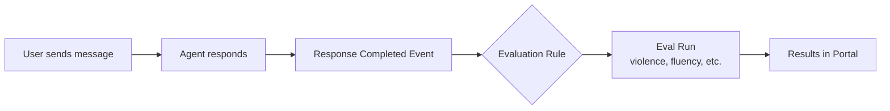
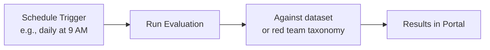

# Monitoring — Production Observability

After deploying your AI agent, monitoring ensures it **maintains quality, safety, and performance** in real-world conditions.

Foundry provides three monitoring mechanisms:

| Mechanism | Description | Trigger |
|-----------|-------------|---------|
| **Continuous Evaluation** | Runs evaluators on every agent response (sampled) | Automatic, on each response |
| **Scheduled Evaluation** | Recurring evaluations on a schedule | Time-based (daily, hourly) |
| **Agent Monitoring Dashboard** | Real-time operational metrics dashboard | Always-on |

## Continuous Evaluation

Continuous evaluation **automatically evaluates agent responses** as they happen. You create a rule that triggers an evaluation run whenever a response is completed.

### How It Works



### Code Pattern

```python
from azure.ai.projects.models import (
    EvaluationRule,
    ContinuousEvaluationRuleAction,
    EvaluationRuleFilter,
    EvaluationRuleEventType,
)

# 1. Create an evaluation with the testing criteria
data_source_config = {"type": "azure_ai_source", "scenario": "responses"}
testing_criteria = [
    {"type": "azure_ai_evaluator", "name": "violence", "evaluator_name": "builtin.violence"}
]
eval_object = openai_client.evals.create(
    name="Continuous Evaluation",
    data_source_config=data_source_config,
    testing_criteria=testing_criteria,
)

# 2. Create the continuous evaluation rule
rule = project_client.evaluation_rules.create_or_update(
    id="my-continuous-eval-rule",
    evaluation_rule=EvaluationRule(
        display_name="My Continuous Eval Rule",
        description="Evaluates every agent response for violence",
        action=ContinuousEvaluationRuleAction(eval_id=eval_object.id, max_hourly_runs=100),
        event_type=EvaluationRuleEventType.RESPONSE_COMPLETED,
        filter=EvaluationRuleFilter(agent_name=agent.name),
        enabled=True,
    ),
)
```

→ [Example 08: Continuous Eval](../examples/08_eval_continuous/)

### Key Parameters

| Parameter | Description |
|-----------|-------------|
| `event_type` | `RESPONSE_COMPLETED` — triggers when an agent response finishes |
| `filter.agent_name` | Only evaluate responses from this specific agent |
| `action.max_hourly_runs` | Rate limit: maximum evaluation runs per hour |
| `enabled` | `True` to activate, `False` to pause |

## Scheduled Evaluation

Scheduled evaluations run **at regular intervals** — useful for regression testing against a known dataset or periodic red teaming.

### Prerequisites for Scheduled Evaluations

Scheduled evaluations run via the project's **Managed Identity**, which needs the `Azure AI User` role:

1. Go to Azure Portal → Your AI Foundry project resource.
2. Access Control (IAM) → Add role assignment.
3. Search for "Azure AI User".
4. Assign to the project's Managed Identity.

> **If you see `ProjectMIUnauthorized`:** The MI is missing roles or the storage firewall is blocking. See [Troubleshooting](02-setup.md#10-troubleshooting-common-errors).

### How It Works



### Code Pattern

```python
from azure.ai.projects.models import (
    Schedule,
    RecurrenceTrigger,
    DailyRecurrenceSchedule,
    EvaluationScheduleTask,
)

# Create a schedule
schedule = Schedule(
    display_name="Daily Quality Check",
    enabled=True,
    trigger=RecurrenceTrigger(
        interval=1,
        schedule=DailyRecurrenceSchedule(hours=[9]),  # Every day at 9 AM
    ),
    task=EvaluationScheduleTask(
        eval_id=eval_object.id,
        eval_run=eval_run_config,  # Dict with data_source, name, etc.
    ),
)

schedule_response = project_client.beta.schedules.create_or_update(
    schedule_id="daily-quality-check",
    schedule=schedule,
)
```

→ [Example 09: Scheduled Eval](../examples/09_eval_scheduled/)

## Agent Monitoring Dashboard

The Agent Monitoring Dashboard in the Foundry portal provides **real-time operational metrics**:

| Metric | Description |
|--------|-------------|
| Token consumption | Total input/output tokens over time |
| Latency | Response time percentiles (p50, p95, p99) |
| Error rates | HTTP error codes and failure rates |
| Quality scores | Aggregated evaluation scores from continuous/scheduled evals |
| Throughput | Requests per minute/hour |

### Accessing the Dashboard

1. In Foundry portal, go to your project.
2. Navigate to **Agents → Monitoring**.
3. Select your agent.

For setup details, see [Monitor agents dashboard](https://learn.microsoft.com/azure/foundry/observability/how-to/how-to-monitor-agents-dashboard).

## Azure Monitor Alerts

Integrate with Azure Monitor to get notified when quality drops:

1. In Application Insights, go to **Alerts → New alert rule**.
2. Create conditions based on custom metrics from evaluation results.
3. Set up action groups (email, webhook, Teams notification, etc.).

Common alert scenarios:

| Alert | Condition |
|-------|-----------|
| Safety violation spike | Violence/hate score > threshold for > N responses |
| Quality degradation | Average coherence score drops below threshold |
| Latency spike | p95 latency exceeds SLA threshold |
| Error rate increase | HTTP 5xx errors exceed threshold |

---

**Next:** [Agent Observability →](06-agent-observability.md)
