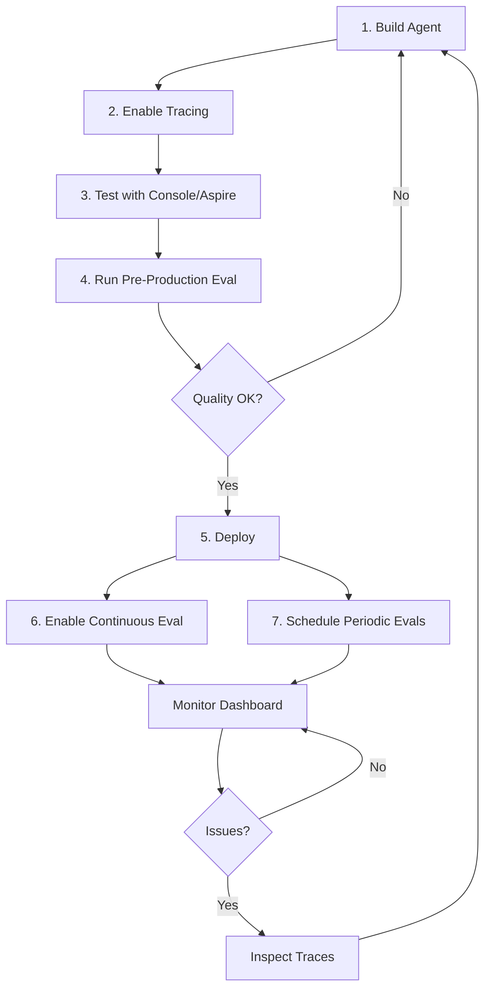

# Agent Observability

AI agents are inherently **non-deterministic and multi-step**. A single user query might trigger:
- Multiple LLM calls
- Tool invocations (search, code execution, API calls)
- Reasoning chains
- Sub-agent delegation

This makes agents harder to debug and evaluate than simple LLM calls. Agent observability addresses this with **specialized tracing** and **agent-specific evaluators**.

## Why Agents Need Special Observability

| Challenge | How Observability Helps |
|-----------|------------------------|
| High number of steps | Trace hierarchy shows every step in execution order |
| Non-deterministic paths | Traces capture the actual path taken for each request |
| Long inputs/outputs | Content recording captures full payloads for inspection |
| Nested tool calls | Hierarchical spans show which tool called which sub-step |
| Tool failures | Span status codes and exceptions pinpoint where issues occur |

## Tracing Agent Conversations

When tracing is enabled, the SDK automatically captures:

```
Trace: "Multi-turn agent conversation"
├── Span: agents.create_version
├── Span: conversations.create
├── Span: responses.create (turn 1)
│   ├── Span: tool_call: get_weather
│   │   ├── Attribute: tool.call.arguments = {"city": "Paris"}
│   │   └── Attribute: tool.call.results = {"temp": "22°C", "conditions": "sunny"}
│   └── Attribute: gen_ai.usage.output_tokens = 145
├── Span: conversations.items.create (user follow-up)
├── Span: responses.create (turn 2)
│   └── Attribute: gen_ai.usage.output_tokens = 89
└── Span: conversations.delete
```

### Passing the Agent ID for Portal Correlation

To see traces correlated with your agent in the Foundry portal, include the agent ID in the `extra_body`:

```python
response = openai_client.responses.create(
    conversation=conversation.id,
    extra_body={
        "agent_reference": {
            "name": agent.name,
            "id": agent.id,
            "type": "agent_reference",
        }
    },
    input="What's the weather in Paris?",
)
```

This links the trace to the agent in the portal's Traces tab.

→ [Example 10: Agent Tracing](../examples/10_agent_tracing/)

## Agent-Specific Evaluators

Beyond general quality/safety evaluators, Foundry provides evaluators designed specifically for agent behavior:

### Tool Usage Evaluators

| Evaluator | What it measures |
|-----------|-----------------|
| `builtin.tool_call_accuracy` | Were the right tools called with the right arguments? |
| `builtin.tool_call_success` | Did tool calls execute successfully? |
| `builtin.tool_input_accuracy` | Were the input parameters to tools correct? |
| `builtin.tool_output_utilization` | Was the tool output actually used in the response? |
| `builtin.tool_selection` | Was the most appropriate tool chosen? |

### Task Evaluators

| Evaluator | What it measures |
|-----------|-----------------|
| `builtin.task_adherence` | Did the agent follow its instructions? |
| `builtin.task_completion` | Did the agent fully complete the user's request? |
| `builtin.intent_resolution` | Did the agent correctly understand the user's intent? |
| `builtin.response_completeness` | Does the response cover all aspects of the query? |
| `builtin.navigation_efficiency` | Did the agent take an efficient path to the answer? |

### Understanding Data Mapping for Agents

The `{{}}` templates in data mapping vary depending on your data source. Here's the key:

| Prefix | Source | Example | When to use |
|--------|--------|---------|-------------|
| `{{item.X}}` | Your input data schema | `{{item.query}}` | Always — maps your test queries |
| `{{sample.X}}` | Agent execution output | `{{sample.output_items}}` | Agent target — the agent's actual response |
| `{{X}}` | Trace fields (direct) | `{{query}}`, `{{response}}` | Trace data source only |

Key `{{sample.*}}` fields:

| Field | Contains | Use for |
|-------|----------|--------|
| `sample.output_text` | Final text response only | Evaluators that only need text (fluency, coherence) |
| `sample.output_items` | Full structured output with tool calls | Tool evaluators + task evaluators |
| `sample.tool_calls` | Just the tool call entries | Specific tool analysis |
| `sample.tool_definitions` | Available tool definitions | **Required by** `tool_call_accuracy` |

### Using Agent Evaluators

When evaluating an agent, use `{{sample.output_items}}` to pass the **structured output** (including tool calls) to evaluators that need it:

```python
testing_criteria = [
    {
        "type": "azure_ai_evaluator",
        "name": "tool_call_accuracy",
        "evaluator_name": "builtin.tool_call_accuracy",
        "initialization_parameters": {"deployment_name": model_deployment_name},
        "data_mapping": {
            "query": "{{item.query}}",
            "response": "{{sample.output_items}}",
        },
    },
    {
        "type": "azure_ai_evaluator",
        "name": "task_adherence",
        "evaluator_name": "builtin.task_adherence",
        "initialization_parameters": {"deployment_name": model_deployment_name},
        "data_mapping": {
            "query": "{{item.query}}",
            "response": "{{sample.output_items}}",
        },
    },
]
```

> **Gotcha — `tool_call_accuracy` needs `tool_definitions`:** If you see `"Tool definitions input is required but not provided"`, add `"tool_definitions": "{{sample.tool_definitions}}"` to the data mapping.
>
> **Gotcha — Tool-call-only agents:** If your agent only makes tool calls (no final text response), `sample.output_text` will be empty. Evaluators like `response_completeness` and `fluency` will fail. Use `task_adherence`, `intent_resolution`, and `tool_call_accuracy` instead.

### Which Evaluators for My Agent?

| Agent type | Recommended evaluators |
|------------|------------------------|
| **Simple text Q&A** (no tools) | `coherence` + `fluency` + `task_adherence` |
| **Agent with tools** | `tool_call_accuracy` + `task_adherence` + `intent_resolution` |
| **Agent with tools + text response** | All of the above + `response_completeness` |
| **Safety-critical agent** | Add `violence` + `hate_unfairness` to any of the above |

→ [Example 11: Agent Evaluation](../examples/11_agent_evaluation/)

## End-to-End Agent Lifecycle

The recommended observability workflow for agents:



1. **Build** — Create your agent with tools and instructions.
2. **Trace** — Enable tracing and use the console or Aspire Dashboard during development.
3. **Evaluate** — Run pre-production evaluations with test data.
4. **Deploy** — Switch tracing to Azure Monitor.
5. **Monitor** — Set up continuous eval rules and scheduled evaluations.
6. **Iterate** — When issues appear, inspect traces to diagnose and fix.

---

**Next:** [Evaluator Reference →](07-evaluator-reference.md)
